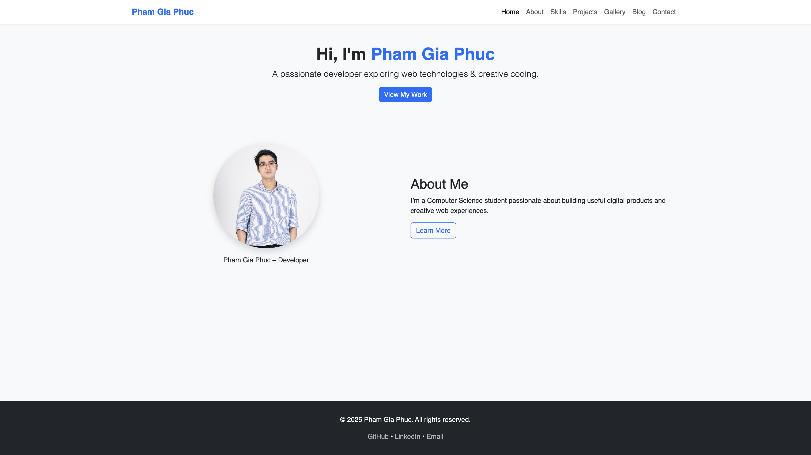

# 🌐 Personal Portfolio Website – Assignment 1

**Name:** Phạm Gia Phúc  
**Student ID:** ITCSIU22178  
**Course:** Web Application Development – Laboratory  
**Assignment:** Lab 1 – Personal Website Project

---

## 📖 Project Overview

This project is a **7–10 page responsive personal website** developed to demonstrate proficiency in **HTML**, **CSS**, **JavaScript**, and **Bootstrap**.  
It presents my personal brand, skills, and portfolio while following **modern web design principles** for usability, accessibility, and responsiveness.

🔗 **Live Demo:** [https://phamgiaphuc.github.io/web-app-lab/assignment1/](https://phamgiaphuc.github.io/web-app-lab/assignment1/)

---

## ⚙️ Tech Stack

- **HTML5** – for structure and semantics
- **CSS3** – for styling and layout customization
- **Bootstrap 5** – for responsive design and pre-built UI components
- **JavaScript** – for interactive behavior and form validation

---

## 🧩 Key Features

- Add meta tags (`charset`, `viewport`, `description`) for SEO and responsiveness
- Include favicon and external stylesheets (Bootstrap 5 + custom CSS)
- Create a sticky responsive navigation bar using Bootstrap components
- Use semantic tags (`main`, `section`, `footer`) for clean structure and accessibility
- Display a profile image with rounded corners and shadow using `` and Bootstrap classes
- Introduce an “About Me” section with structured headings and text content
- Load Bootstrap JavaScript bundle for responsive navbar toggling
- Add a **contact form** with validation and input fields
- Embed a **YouTube video** using the `<iframe>` tag
- Hosted and deployed via **GitHub Pages**

---

## 📄 Website Pages

| Page         | Description                                 |
| ------------ | ------------------------------------------- |
| **Home**     | Introduction and personal brand overview    |
| **About**    | Biography and academic background           |
| **Skills**   | Technical and professional skills           |
| **Projects** | Portfolio showcasing development works      |
| **Gallery**  | Image showcase of creative and coding works |
| **Blog**     | Articles or updates related to technology   |
| **Contact**  | Contact form and external social links      |

---

## 🧠 Learning Outcomes

- Built a fully responsive multi-page website using Bootstrap grid and utility classes
- Improved understanding of HTML5 semantic elements and accessibility guidelines
- Practiced external CSS structuring and responsive design techniques
- Gained experience in client-side deployment using GitHub Pages

---

## 📸 Preview

---

## 🧾 License

This project is created for **educational purposes** under Web Application Development Laboratory – International University, Vietnam National University, Ho Chi Minh City.
